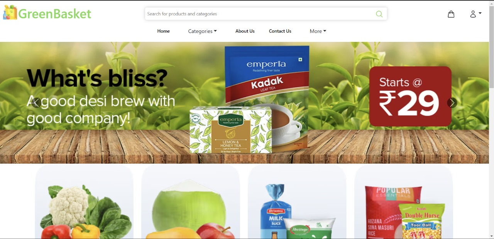
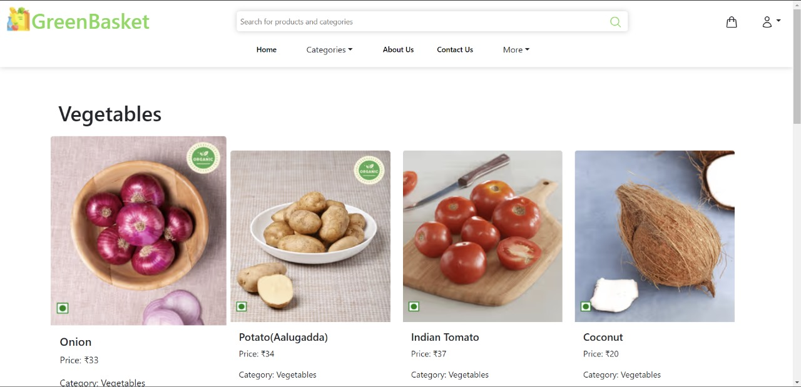
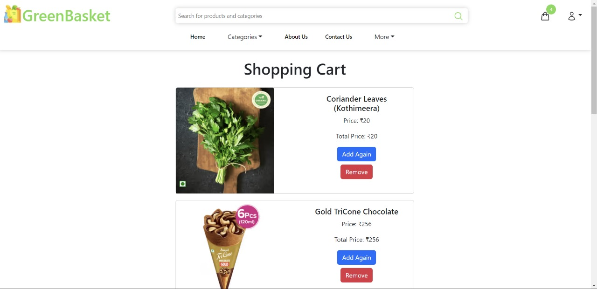
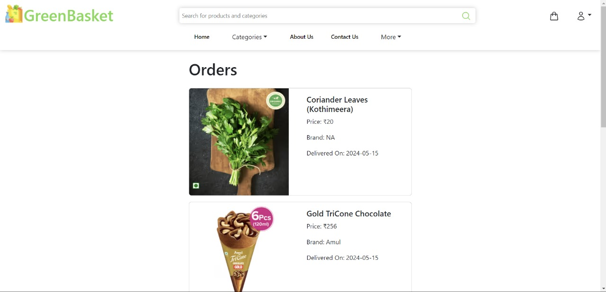
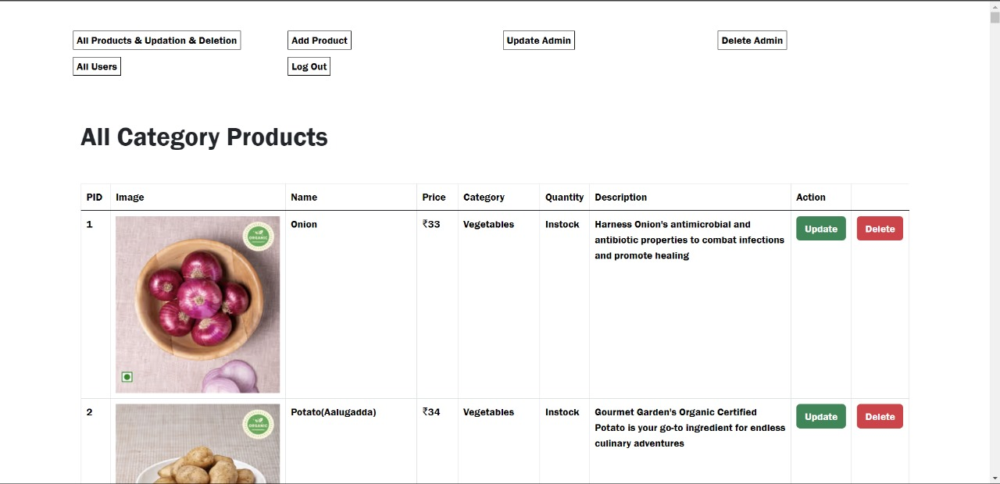

# Green Basket Online Grocery Website

## Overview
Green Basket is a user-friendly online grocery platform designed to simplify the process of buying groceries online. The platform allows users to browse through various categories of products, add items to their cart, and securely checkout. The website is optimized for both desktop and mobile use, ensuring a seamless shopping experience.

## Key Features
- **User Registration and Login**: Secure user authentication with email verification.
- **Product Browsing**: Easy navigation through various categories of products.
- **Search Functionality**: Advanced search to quickly find products.
- **Shopping Cart**: Users can add, remove, and update items in their cart.
- **Order History**: Users can view their past orders.
- **Secure Checkout**: Multiple payment options with a secure checkout process.
- **Admin Panel**: Manage products, categories, and user information.
- **Responsive Design**: Optimized for both desktop and mobile view.

## Screenshots Demonstrating the Execution of the Application
- **Home Page**: 

- **Product Listing**: 

- **Shopping Cart**: 

- **Order Page**: 

- **Admin Panel**: 

## GitHub Link
You can access the source code for both the frontend and backend of the Green Basket project on GitHub: [Green Basket GitHub Repository](https://github.com/Narendravura/Green-bucket-store)
